# Leather Point Store 👜

A professional, e-commerce web application developed in **Object-Oriented PHP (OOP)** and styled with modern, responsive **Tailwind CSS**.

---

## 🚀 Key Professional Features
- **Object-Oriented Programming (OOP):** Complete business models encapsulated in standalone classes with robust encapsulation, property bindings, and modular constructor dependency injections.
- **Secure Database Interactions:** Powered by **PHP Data Objects (PDO)** utilizing strictly parameterized, prepared statements to completely mitigate SQL injection risks.
- **Secure Hashing:** Customer passwords are salted and hashed using modern `PASSWORD_BCRYPT` cryptographies.
- **XSS Prevention:** Clean inputs sanitized dynamically using recursive string strips and `htmlspecialchars()` output encodings.
- **Session-Based State Management:** Secure multi-role authentication controls separating Standard Users and Administrative Desk operators.
- **Automatic Fallback Simulator ( recruiter-friendly ):** If a MySQL server is not configured, the site automatically enables an interactive **Session Mock DB Fallback mode** letting users register, log in, search, write reviews, check out, and administer orders in real-time completely out-of-the-box!

---

## 📁 Repository Directory Structure
```text
leather-point-store/
│
├── config/
│   └── Database.php          # Database Connection class (PDO Pattern)
│
├── classes/
│   ├── User.php              # Auth operations, profiles & directories
│   ├── Product.php           # Catalog, filtering & categories CRUD
│   ├── Order.php             # Checkout transactions, stocks, notification simulator
│   └── Review.php            # Rating reviews & feedback channels
│
├── includes/
│   ├── header.php            # Nav, UI fallbacks, responsive header
│   └── footer.php            # Info footers, login quick references
│
├── admin/                    # Administrative Desk Panel
│   ├── includes/
│   │   ├── header.php        # Admin sidebar navigation
│   │   └── footer.php
│   ├── dashboard.php         # Metric panels (Admin 3)
│   ├── categories.php        # Category CRUD (Admin 4)
│   ├── subcategories.php     # Subcategory CRUD (Admin 5)
│   ├── products.php          # Inventory Stock Management CRUD (Admin 2)
│   ├── users.php             # Customer Directories directories (Admin 6, 7, 8)
│   ├── orders.php            # Order Approvals & Cancel lists (Admin 9, 10)
│   ├── feedbacks.php         # Feedbacks list reading
│   └── logout.php
│
├── logs/
│   └── receipt_notifications.log   # Simulated SMS & Email invoices trace file (FR8)
│
├── index.php                 # Storefront catalog, multi-filter search (FR3)
├── product-details.php       # Product page, ratings review panel (FR7)
├── cart.php                  # Shopping Cart
├── checkout.php              # COD/Credit Card selection checkout (FR4)
├── order-status.php          # Specific status tracker & printable receipt (FR5, FR8)
├── feedback.php              # General service feedback submissions (FR7)
├── login.php                 # Secure login entry (FR2)
├── register.php              # New user registration (FR1)
├── logout.php                # Clears session cookies
│
├── schema.sql                # Full database structures & seed variables
└── README.md                 # Professional technical overview
```

---

## 📋 Functional Requirements Map

This application is fully responsive and implements all functional specifications using clean OOP models:

### Customer-Facing Requirements (FR)
| Requirement ID | Description | OOP Implementation Path |
| :--- | :--- | :--- |
| **FR1: Registration** | Create a registration page for new users. | `register.php` utilizing `User::register()` with standard password hashing. |
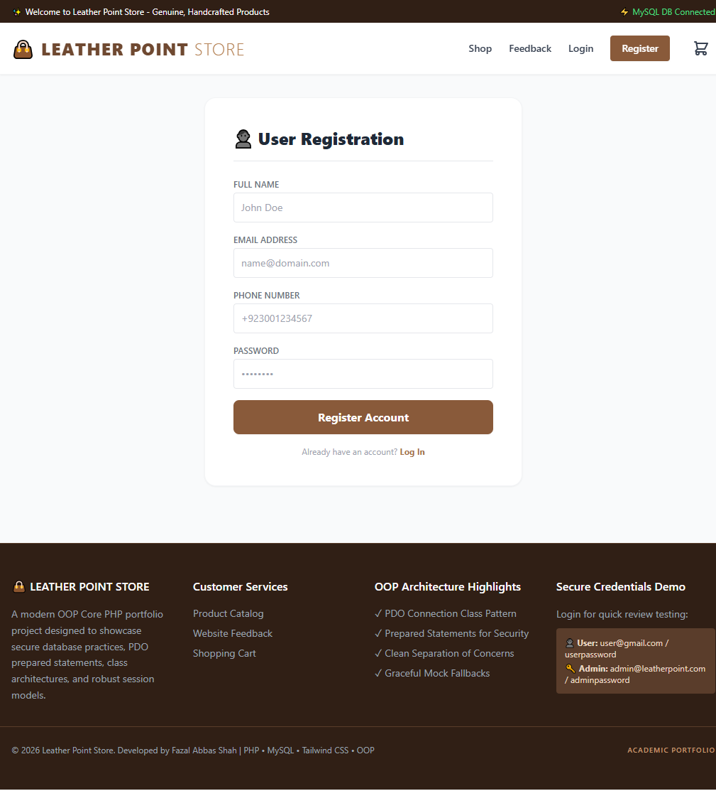

| **FR2: Login** | Secure login credentials authentication. | `login.php` using `User::login()` verifying against hashed storage. |
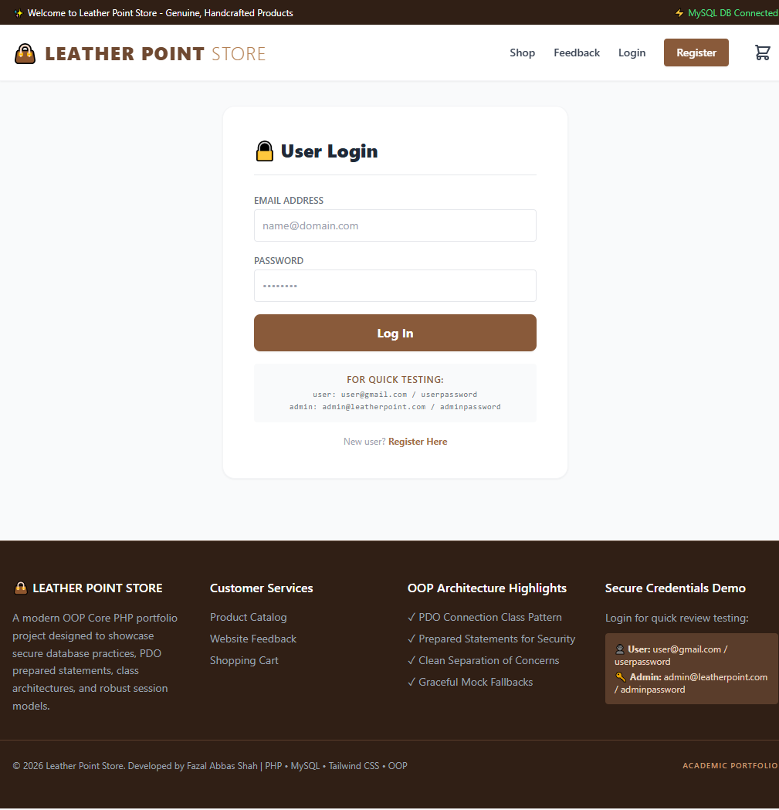

| **FR3: Search Box** | Multi-attribute search (by name, price, and color). | `index.php` using `Product::getProducts()` utilizing multi-conditional dynamic SQL. |
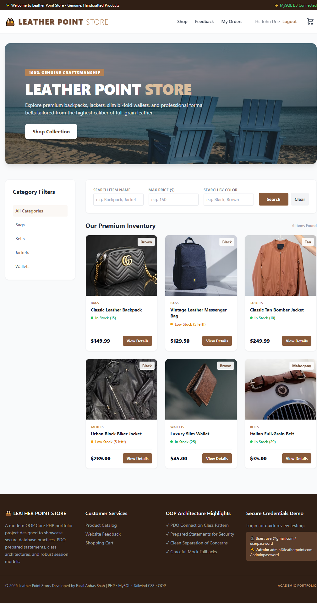

| **FR4: Payment Methods** | Choose Credit Card or Cash On Delivery (COD). | `checkout.php` capturing inputs and storing choices in order rows. |
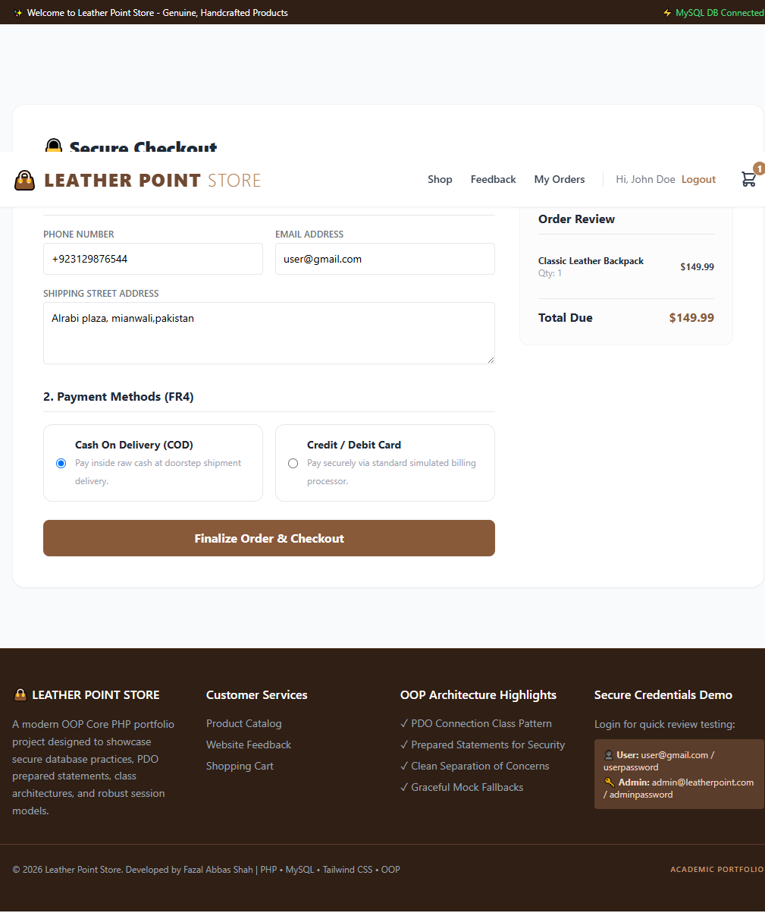

| **FR5: Order Status** | Check order shipment status (Approved/Pending/Cancel). | `order-status.php` pulling status properties through `Order::getOrderDetails()`. |
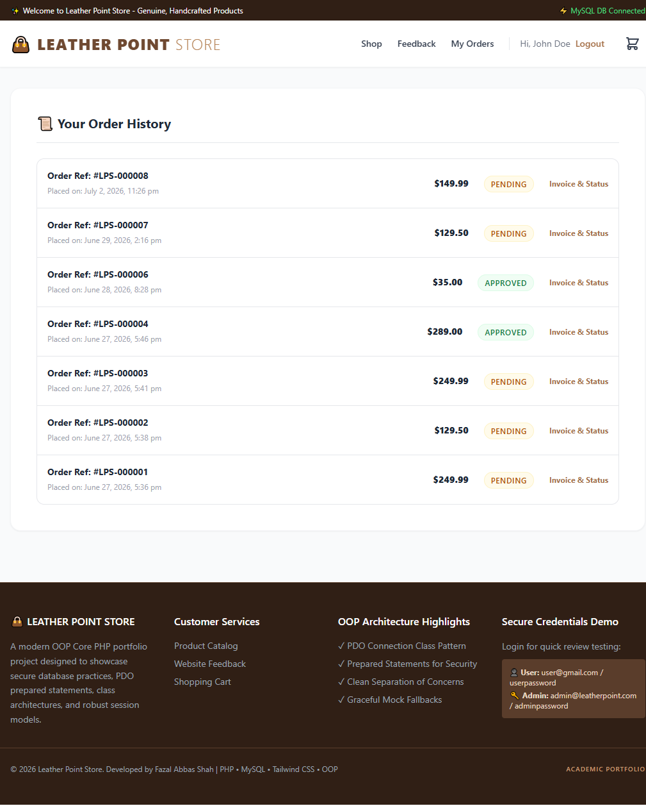


| **FR6: Order History** | List complete historical customer purchases. | `order-status.php` listing orders via `Order::getUserOrders()`. |


| **FR7: Reviews & Feedbacks** | Submit product review stars and general website feedback. | `product-details.php` using `Review::addProductReview()`; `feedback.php` using `Review::addWebsiteFeedback()`. |
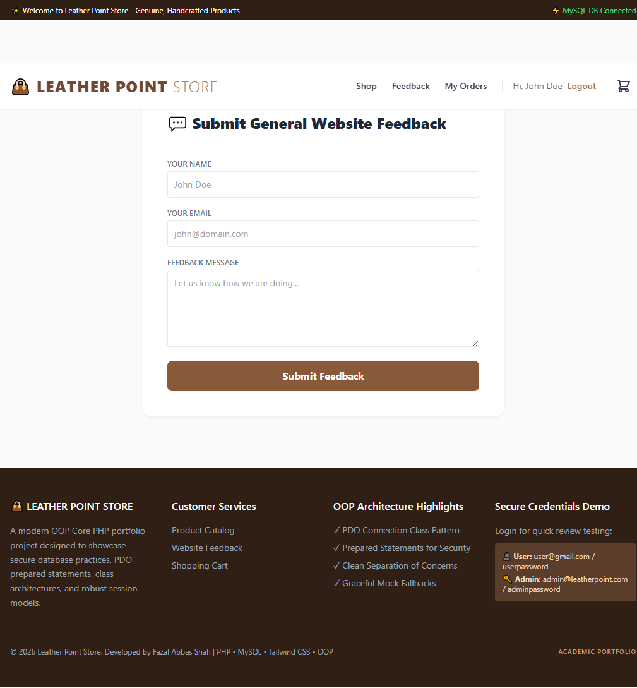

| **FR8: Confirm Receipt** | Simulate transaction copy receipt logging to phone & email. | `Order::simulateTransactionReceipt()` writing logs to `logs/receipt_notifications.log` displayed visually in real-time. |
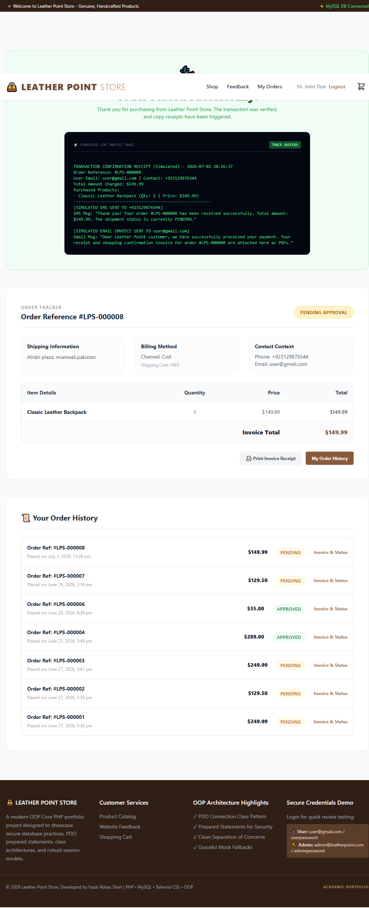


### Administrative Requirements (Admin)
| Requirement ID | Description | OOP Implementation Path |
| :--- | :--- | :--- |
| **Admin 1: Admin Login** | Specialized administrator authorization gate. | `admin/includes/header.php` verification checks; secure login via `User::login()`. |


| **Admin 2: Stock Management** | Control item prices, specs, images, colors, and quantities. | `admin/products.php` performing edits using `Product::updateProduct()` & `Product::deleteProduct()`. |
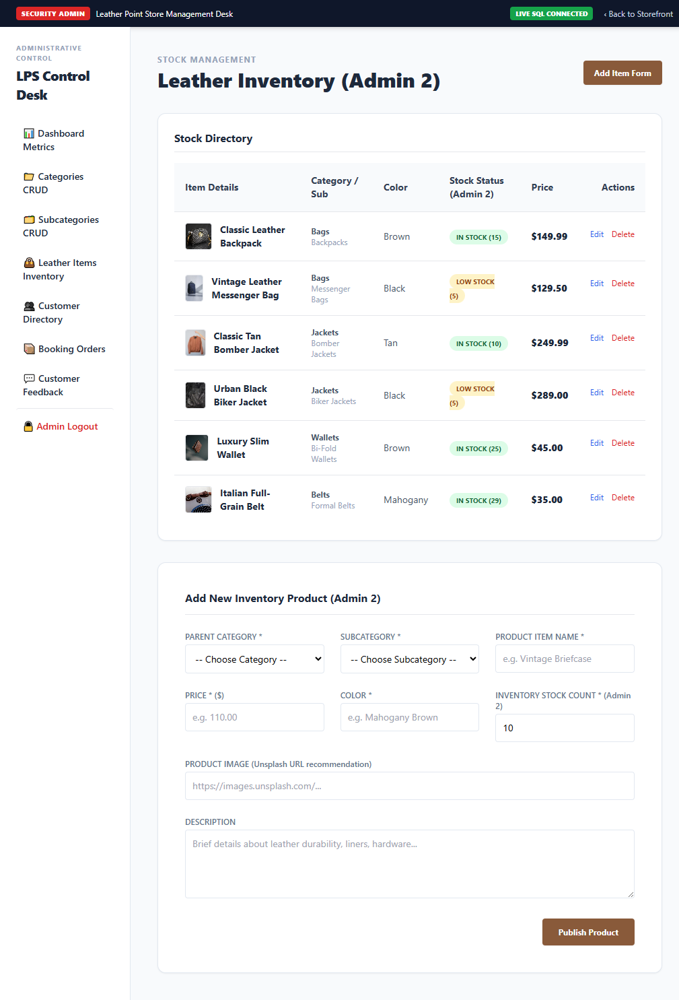

| **Admin 3: Metric Dashboard** | View counts of users, orders, categories, and active feedback feeds. | `admin/dashboard.php` querying statistical records; `admin/feedbacks.php` listing messages. |
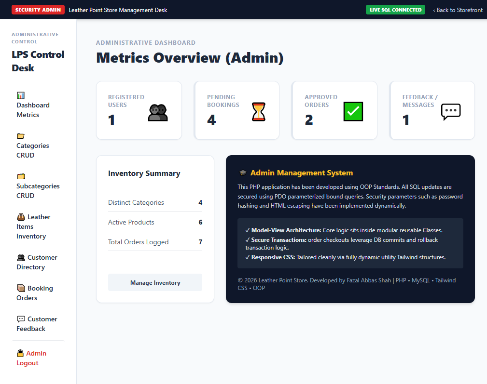

| **Admin 4: Categories CRUD** | Add, edit, or delete item classifications. | `admin/categories.php` using `Product::addCategory()`, `Product::updateCategory()`, etc. |
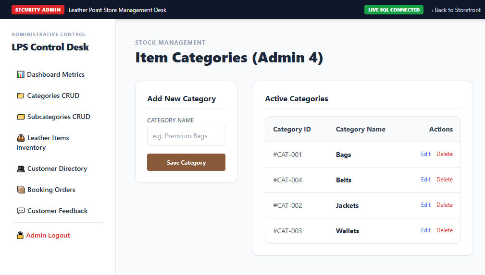

| **Admin 5: Subcategories CRUD** | Add, edit, or delete related classifications. | `admin/subcategories.php` using `Product::addSubcategory()`, `Product::updateSubcategory()`, etc. |
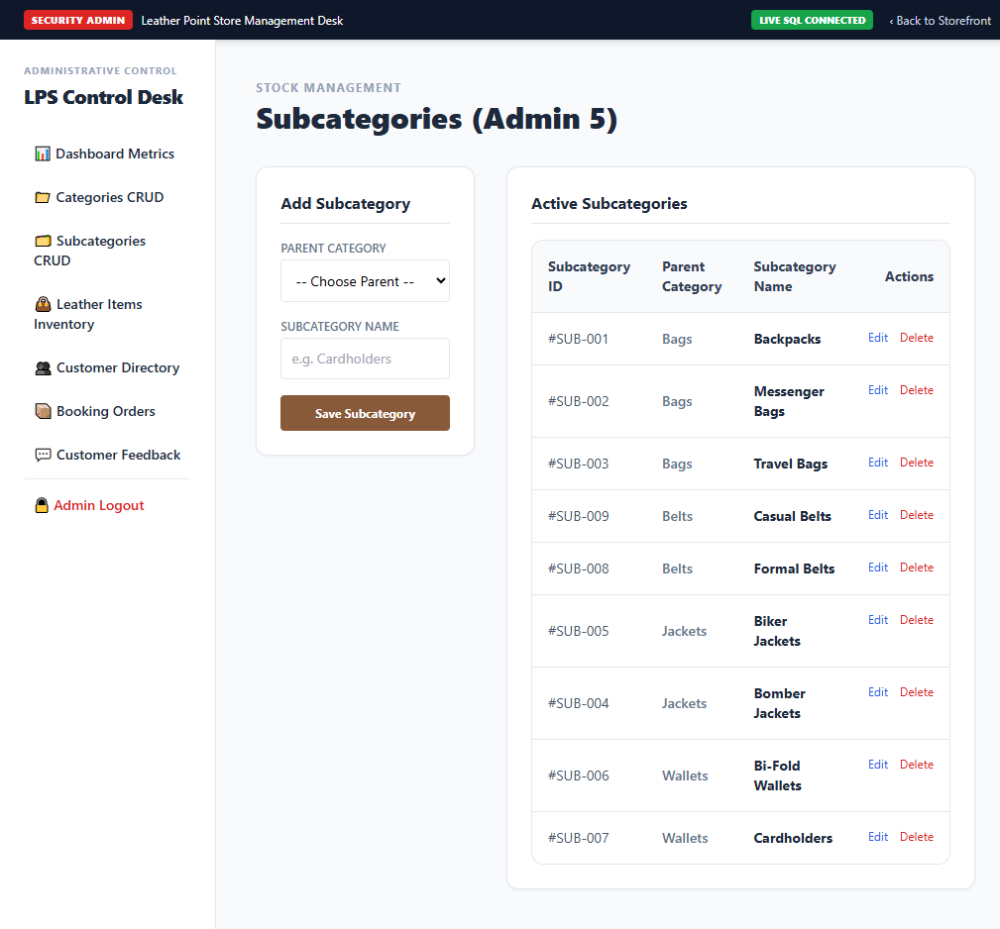

| **Admin 6: Customers Directory** | List all registered non-admin users. | `admin/users.php` listing database directories using `User::getAllUsers()`. |
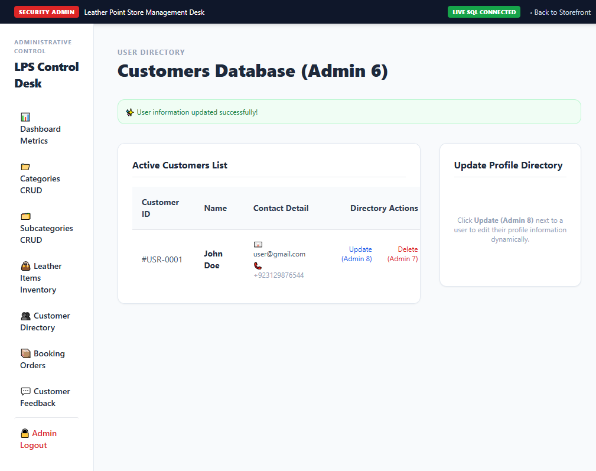

| **Admin 7: Delete Users** | Remove accounts from the store directories. | `admin/users.php` using `User::deleteUser()`. |


| **Admin 8: Update Users** | Edit name, email, and contact details of existing profiles. | `admin/users.php` editing profiles using `User::updateUserInfo()`. |


| **Admin 9: Orders History** | Inspect and monitor all customer booking logs. | `admin/orders.php` listing overall histories via `Order::getAllOrders()`. |


| **Admin 10: Approve / Cancel** | Approve orders for dispatch or cancel bookings. | `admin/orders.php` toggling states using `Order::updateStatus()`. |


---

## 🛠️ Installation & Setup Instructions

### 1. Database Setup (MySQL)
1. Open your database administration dashboard (e.g., **phpMyAdmin** or **MySQL Workbench**).
2. Create a new database named `leather_point_db`.
3. Import the `schema.sql` file into your newly created database.

### 2. Configure PHP Connection
1. Open `config/Database.php`.
2. Update your credentials (host, user, password, database name) inside the private properties:
   ```php
   private $host = "localhost";
   private $db_name = "leather_point_db";
   private $username = "root";
   private $password = ""; // your DB password
   ```

### 3. Quick Run Credentials
Use these pre-seeded users to test out both roles immediately:
- **Customer User Account:**
  - **Email:** `user@gmail.com`
  - **Password:** `userpassword`
- **Administrator Account:**
  - **Email:** `admin@leatherpoint.com`
  - **Password:** `adminpassword`

---

## 🎓 Showcase Highlights for Recruiters
- **Strict OOP Principles:** Standardised classes with dedicated responsibilities. Separation of templates, controllers, and models.
- **Relational Integrity:** Foreign key definitions (cascade deletions on categories and subcategories), indexing optimizations, and InnoDB specifications.
- **Secure Transaction Commits:** Order placement uses DB transactions, executing rollbacks on system failures to protect stock count balances.
- **Graceful Error Resilience:** No database connectivity limits usability during brief showcase evaluations — simulated state persists throughout sessions.
