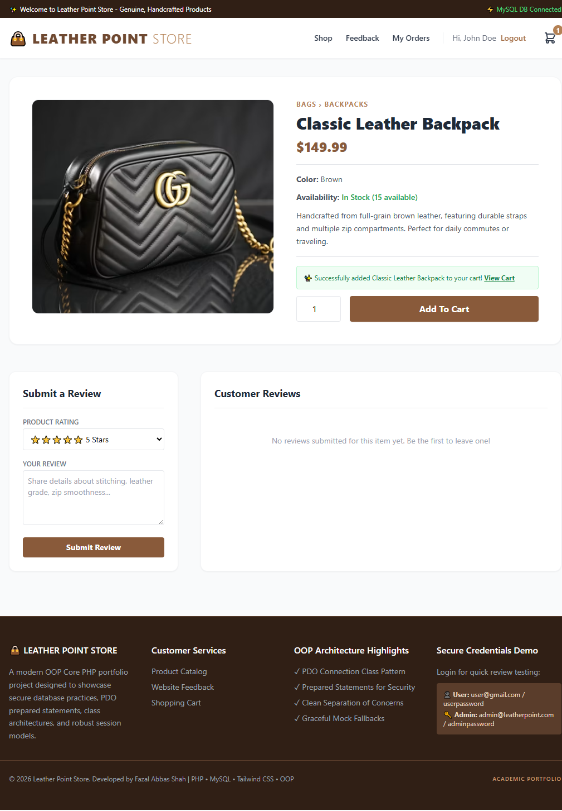
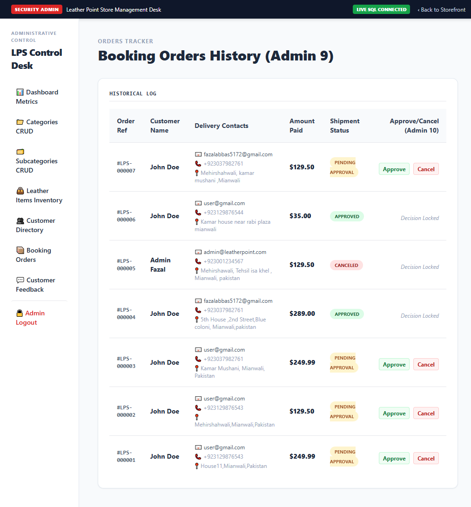

<p align="center">

<h1 align="center">👜 Leather Point Store</h1>

<p align="center">
A full-stack e-commerce web application built with Core PHP (OOP), PDO, MySQL, and Tailwind CSS
</p>

<p align="center">


</p>

</p>


---

# 📌 Overview

**Leather Point Store** is a full-stack e-commerce web application developed using **Core PHP (Object-Oriented Programming), PDO, MySQL, and Tailwind CSS**.

The application demonstrates real-world web development practices including:

- Secure authentication
- Role-based authorization
- Product management
- Shopping cart functionality
- Checkout workflow
- Order processing
- Customer reviews
- Administrative inventory management


The project follows a modular OOP architecture where business logic is separated into reusable classes:

| Class | Responsibility |
|------|----------------|
| `User` | Authentication, profiles and customer management |
| `Product` | Product catalog and inventory operations |
| `Order` | Checkout and order processing |
| `Review` | Customer reviews and feedback management |


The application is designed with a clean separation between:

- Configuration
- Database layer
- Business logic
- Presentation layer
- Administrative operations


---

# ✨ Key Features


## 🔐 Authentication & Security

- Secure customer registration and login
- Role-based authentication for customers and administrators
- Password encryption using `password_hash()` with `PASSWORD_BCRYPT`
- PDO prepared statements for SQL injection prevention
- XSS protection using sanitized output with `htmlspecialchars()`
- Secure session-based state management


---

# 👤 Customer Features

- Customer registration and authentication
- Product catalog browsing
- Multi-attribute product search:
  - Product name
  - Price
  - Color
- Product details with customer reviews
- Shopping cart management
- Checkout workflow
- Payment method selection:
  - Credit Card
  - Cash on Delivery (COD)
- Order tracking
- Order history
- Customer feedback submission
- Transaction receipt simulation


---

# 🛡️ Admin Dashboard Features

- Secure administrator authentication
- Dashboard statistics and overview metrics
- Product management:
  - Add products
  - Update products
  - Delete products
  - Manage inventory quantities
- Category management
- Subcategory management
- Customer management
- Order management:
  - View orders
  - Approve orders
  - Cancel orders
  - Update order status
- Customer feedback management


---

# 🏗️ Architecture & Code Quality

The application follows a modular Object-Oriented PHP architecture.

Implemented concepts:

- Object-Oriented Programming (OOP)
- Encapsulation of business logic
- Reusable PHP classes
- Constructor dependency injection
- PDO database abstraction
- Centralized application initialization
- Separation of application layers


---

# 📁 Repository Structure


```text
leather-point-store/

│
├── config/
│   ├── app.php
│   │   # Application configuration and APP_URL settings
│   │
│   ├── bootstrap.php
│   │   # Centralized application initialization
│   │
│   ├── Database.php
│   │   # PDO database connection class
│   │
│   └── developer.php
│       # Developer configuration
│
├── classes/
│   ├── User.php
│   │   # Authentication and customer management
│   │
│   ├── Product.php
│   │   # Product catalog and inventory operations
│   │
│   ├── Order.php
│   │   # Checkout and order processing
│   │
│   └── Review.php
│       # Product reviews and feedback
│
├── includes/
│   ├── init.php
│   │   # Customer application initialization
│   │
│   ├── header.php
│   │   # Storefront navigation
│   │
│   ├── footer.php
│   │   # Shared footer layout
│   │
│   └── contact-widget.php
│       # Developer contact widget
│
├── admin/
│
│   ├── includes/
│   │   ├── init.php
│   │   ├── header.php
│   │   └── footer.php
│
│   ├── dashboard.php
│   ├── products.php
│   ├── categories.php
│   ├── subcategories.php
│   ├── users.php
│   ├── orders.php
│   └── feedbacks.php
│
├── assets/
│   ├── css/
│   │   └── contact-widget.css
│   │
│   └── js/
│       └── contact-widget.js
│
├── screenshots/
│   # Project screenshots
│
├── logs/
│   └── receipt_notifications.log
│       # Simulated transaction logs
│
├── downloads/
│   └── Fazal-Abbas-Shah-Resume.pdf
│
├── index.php
├── product-details.php
├── cart.php
├── checkout.php
├── order-status.php
├── feedback.php
├── login.php
├── register.php
├── logout.php
│
├── schema.sql
│   # Database schema and sample data
│
└── README.md
```
---

# 📸 Screenshots

The following screenshots demonstrate the main customer-facing and administrative workflows of the application.


# 👤 Customer Side


## 📝 Registration

Secure customer registration with password hashing and account creation.


---


## 🔐 Login

Authentication system with session-based access control.


---


## 🏠 Store Homepage

Product catalog displaying available leather products with search functionality.


---


## 🛒 Add To Cart

Customers can add products to their shopping cart before checkout.




---


## 🛍️ Shopping Cart

Cart management with product quantities and order summary.


---


## 💳 Checkout

Checkout workflow supporting multiple payment methods:

- Credit Card
- Cash on Delivery (COD)


---


## 📦 Order History & Status

Customers can view previous purchases and track order processing status.


---


## 🧾 Order Details

Detailed order information with transaction receipt simulation.


---


## ⭐ Customer Feedback

Customers can submit product reviews and website feedback.


---


# 🛡️ Admin Panel


## 📊 Admin Dashboard

Administrative overview displaying:

- Users
- Orders
- Products
- Categories
- Feedback statistics


---


## 📦 Inventory Management

Manage product information including:

- Product names
- Prices
- Images
- Colors
- Specifications
- Stock quantities


---


## 🗂️ Category Management

Create, update, and delete product categories.


---


## 📂 Subcategory Management

Manage product subcategories.


---


## 👥 Customer Management

View and manage registered customer accounts.


---


## 📋 Order Management

Approve, cancel, and update customer order statuses.




---

# 🛠️ Tech Stack


| Layer | Technology |
|------|------------|
| Backend | Core PHP 8+ (Object-Oriented Programming) |
| Database | MySQL / MariaDB |
| Database Layer | PDO with Prepared Statements |
| Frontend | HTML5, Tailwind CSS, JavaScript |
| Authentication | PHP Sessions + bcrypt password hashing |
| Server | Apache (XAMPP/WAMP/Laragon) |
| Version Control | Git & GitHub |


---

# 🚀 Installation & Setup Instructions


## Prerequisites

Before running the project locally, ensure the following are installed:

- PHP 8.0 or higher
- MySQL 5.7+ / MariaDB
- Apache Server (XAMPP, WAMP, or Laragon)
- Git


---

# 1. Clone Repository


```bash
git clone https://github.com/Fazal5172/leather-point-store.git

cd leather-point-store


---

# 🌐 Live Demo


The application is deployed online and available for portfolio evaluation.

You can explore both customer and administrator workflows using the demo credentials provided below.


| Portal | URL |
|--------|-----|
| 👤 Customer Store | https://leatherstore.lovestoblog.com |
| 🛡️ Admin Dashboard | https://leatherstore.lovestoblog.com/admin |


> **Note:**  
> This is a public demonstration environment created for portfolio evaluation.  
> Demo data may be reset periodically.


---

# 🔑 Demo Login Credentials


## 👤 Customer Account


| Role | Email | Password |
|------|-------|----------|
| Customer | user@gmail.com | `userpassword` |


Customer can explore:

- Product browsing
- Product search
- Shopping cart
- Checkout workflow
- Order tracking
- Order history
- Reviews and feedback


---


## 🛡️ Administrator Account


| Role | Email | Password |
|------|-------|----------|
| Administrator | admin@leatherpoint.com | `adminpassword` |


Administrator can explore:

- Dashboard statistics
- Product management
- Inventory management
- Category management
- Subcategory management
- Customer management
- Order processing
- Feedback management


> ⚠️ **Important:**  
> Demo credentials are provided only for evaluation purposes.  
> Change all passwords before using the application in a production environment.


---

# 👨‍💻 Author


**Fazal Abbas Shah**

PHP Developer | Backend Web Developer


### GitHub

https://github.com/Fazal5172


### LinkedIn

https://www.linkedin.com/in/fazal111/


---

# 📄 License


This project is licensed under the MIT License.