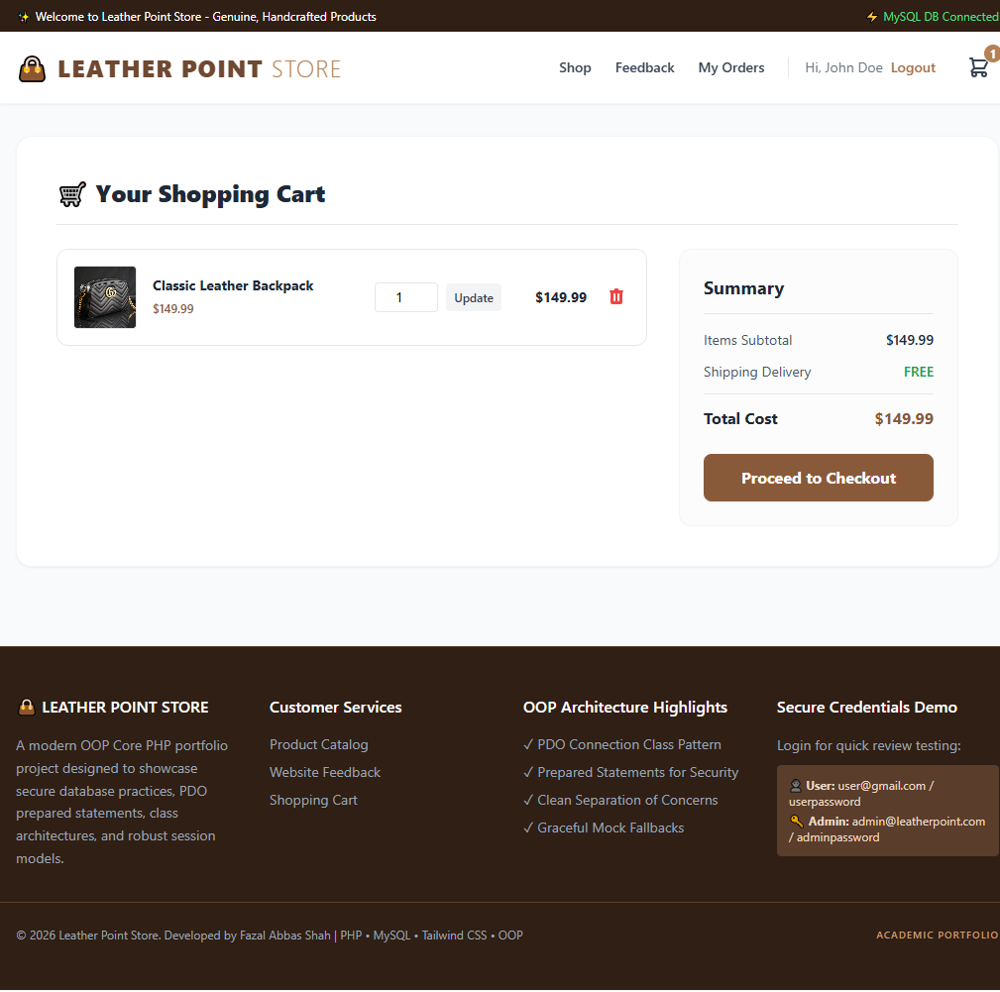

# Leather Point Store 👜

A professional, e-commerce web application developed in **Object-Oriented PHP (OOP)** and styled with modern, responsive **Tailwind CSS**.

---

## 🚀 Key Professional Features
- **Object-Oriented Programming (OOP):** Complete business models encapsulated in standalone classes with robust encapsulation, property bindings, and modular constructor dependency injections.
- **Secure Database Interactions:** Powered by **PHP Data Objects (PDO)** utilizing strictly parameterized, prepared statements to completely mitigate SQL injection risks.
- **Secure Hashing:** Customer passwords are salted and hashed using modern `PASSWORD_BCRYPT` cryptographies.
- **XSS Prevention:** Clean inputs sanitized dynamically using recursive string strips and `htmlspecialchars()` output encodings.
- **Session-Based State Management:** Secure multi-role authentication controls separating Standard Users and Administrative Desk operators.
- **Automatic Fallback Simulator ( recruiter-friendly ):** If a MySQL server is not configured, the site automatically enables an interactive **Session Mock DB Fallback mode** letting users register, log in, search, write reviews, check out, and administer orders in real-time completely out-of-the-box!

---

## 📁 Repository Directory Structure
```text
leather-point-store/
│
├── config/
│   ├── app.php               # Application configuration (APP_URL & global settings)
│   ├── bootstrap.php         # Centralized application initialization
│   ├── Database.php          # Database Connection class (PDO Pattern)
│   └── developer.php         # Developer contact & portfolio configuration
│
├── classes/
│   ├── User.php              # Authentication, profiles & customer management
│   ├── Product.php           # Product catalog & inventory operations
│   ├── Order.php             # Checkout, order processing & notifications
│   └── Review.php            # Product ratings & customer reviews
│
├── includes/
│   ├── init.php              # Customer application initialization
│   ├── header.php            # Storefront navigation & page header
│   ├── footer.php            # Footer layout & shared scripts
│   └── contact-widget.php    # Floating developer contact widget
│
├── admin/                    # Administrative Control Panel
│   ├── includes/
│   │   ├── init.php          # Admin application initialization & authorization
│   │   ├── header.php        # Admin sidebar & dashboard layout
│   │   └── footer.php        # Admin footer
│   ├── categories.php        # Category CRUD management
│   ├── dashboard.php         # Dashboard metrics & statistics
│   ├── feedbacks.php         # Customer feedback management
│   ├── logout.php            # Terminates admin session
│   ├── orders.php            # Order approval & management
│   ├── products.php          # Inventory & product management
│   ├── subcategories.php     # Subcategory CRUD management
│   └── users.php             # Customer directory management│
├── assets/
│   ├── css/
│   │   └── contact-widget.css    # Floating contact widget styles
│   └── js/
│       └── contact-widget.js     # Floating contact widget interactions
│
├── downloads/
│   └── Fazal-Abbas-Shah-Resume.pdf    # Downloadable resume
│
├── logs/
│   └── receipt_notifications.log      # Simulated SMS & Email notification logs
│
├── screenshots/              # README project screenshots
│
├── index.php                 # Storefront catalog & product listing (FR3)
├── product-details.php       # Product details & review page (FR7)
├── cart.php                  # Shopping cart
├── checkout.php              # Checkout & payment selection (FR4)
├── order-status.php          # Order tracking & printable receipt (FR5, FR8)
├── feedback.php              # Customer feedback submission (FR7)
├── login.php                 # Secure user authentication (FR2)
├── register.php              # Customer registration (FR1)
├── logout.php                # User/Admin logout & session termination
│
├── schema.sql                # Database schema & sample data
└── README.md                 # Professional project documentation
---

## 📋 Functional Requirements Map

This application is fully responsive and implements all functional specifications using clean OOP models:
# Functional Requirements

## Customer-Facing Requirements (FR)

| Requirement ID | Description | OOP Implementation Path |
| :--- | :--- | :--- |
| **FR1: Registration** | Create a registration page for new users. | `register.php` using `User::register()` with secure password hashing. |
| **FR2: Login** | Secure user authentication using stored credentials. | `login.php` using `User::login()` with password verification. |
| **FR3: Search Box** | Multi-attribute product search by name, price, and color. | `index.php` using `Product::getProducts()` with dynamic SQL conditions. |
| **FR4: Payment Methods** | Support Credit Card and Cash On Delivery (COD). | `checkout.php` storing selected payment methods with order records. |
| **FR5: Order Status** | Customers can track order shipment status (Approved/Pending/Cancel). | `order-status.php` using `Order::getOrderDetails()`. |
| **FR6: Order History** | Display customer's complete purchase history. | `order-status.php` using `Order::getUserOrders()`. |
| **FR7: Reviews & Feedbacks** | Users can submit product reviews and website feedback. | `product-details.php` and `feedback.php` using Review methods. |
| **FR8: Confirm Receipt** | Simulate transaction receipt notification logging. | `Order::simulateTransactionReceipt()` storing receipt notification logs. |


## Administrative Requirements (Admin)

| Requirement ID | Description | OOP Implementation Path |
| :--- | :--- | :--- |
| **Admin 1: Admin Login** | Secure administrator authentication. | `admin/includes/header.php` with role verification. |
| **Admin 2: Stock Management** | Manage product prices, specifications, images, colors, and quantities. | `admin/products.php` using Product CRUD methods. |
| **Admin 3: Dashboard Metrics** | View users, orders, categories, and feedback statistics. | `admin/dashboard.php` with database statistics queries. |
| **Admin 4: Categories CRUD** | Create, update, and delete product categories. | `admin/categories.php` using Product category methods. |
| **Admin 5: Subcategories CRUD** | Manage product subcategories. | `admin/subcategories.php` using subcategory methods. |
| **Admin 6: Customer Directory** | View registered customer accounts. | `admin/users.php` using `User::getAllUsers()`. |
| **Admin 7: Delete Users** | Remove customer accounts. | `admin/users.php` using `User::deleteUser()`. |
| **Admin 8: Update Users** | Update customer profile information. | `admin/users.php` using `User::updateUserInfo()`. |
| **Admin 9: Orders History** | View all customer orders. | `admin/orders.php` using `Order::getAllOrders()`. |
| **Admin 10: Approve / Cancel Orders** | Update order processing status. | `admin/orders.php` using `Order::updateStatus()`. |
---

# Screenshots

## Customer Side

### Registration


---

### Login


---

### Home Page


---

### Shopping Cart



---

### Checkout


# Screenshots

## Customer Side

### Registration


### Login


### Home Page


### Shopping Cart


### Checkout


### Order History


### Order Details


### Feedback


## Admin Panel


### Dashboard


### Inventory Management


### Category Management


### Subcategory Management


### User Management


### Order Management


----

## 🛠️ Installation & Setup Instructions

### 1. Database Setup (MySQL)
1. Open your database administration dashboard (e.g., **phpMyAdmin** or **MySQL Workbench**).
2. Create a new database named `leather_point_db`.
3. Import the `schema.sql` file into your newly created database.

### 2. Configure PHP Connection
1. Open `config/Database.php`.
2. Update your credentials (host, user, password, database name) inside the private properties:
   ```php
   private $host = "localhost";
   private $db_name = "leather_point_db";
   private $username = "root";
   private $password = ""; // your DB password
   ```

### 3. Quick Run Credentials
Use these pre-seeded users to test out both roles immediately:
- **Customer User Account:**
  - **Email:** `user@gmail.com`
  - **Password:** `userpassword`
- **Administrator Account:**
  - **Email:** `admin@leatherpoint.com`
  - **Password:** `adminpassword`

---
